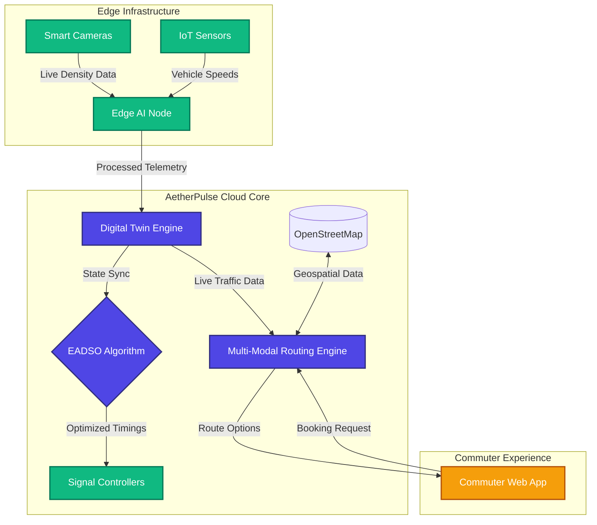
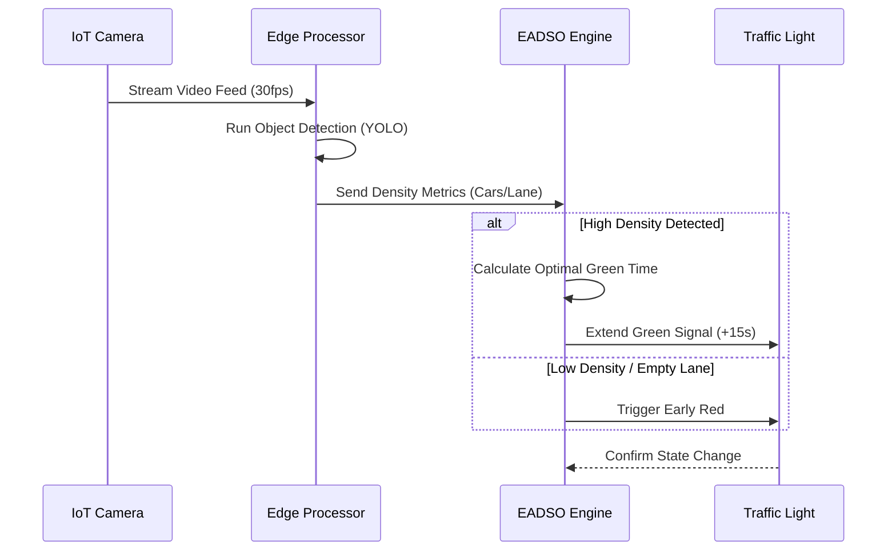

<div align="center">
<div align="center">

# 🚦 AetherPulse
### Next-Generation Smart Mobility & Digital Twin Platform

[](https://vocal-salamander-0eff6e.netlify.app/)
[](https://reactjs.org/)
[](https://vitejs.dev/)
[](https://tailwindcss.com/)
[](https://leafletjs.com/)

**🌐 Interactive Production Deployment:**(https://aether-pulse.netlify.app/)

AetherPulse is a comprehensive Smart Mobility Platform designed to eliminate urban congestion. By combining **Edge AI Dynamic Signal Optimization (EADSO)**, live digital twin simulations, and seamless multi-modal commuter handoffs, AetherPulse cuts commute times, reduces CO₂ emissions, and saves money.

[Explore the Architecture](#-system-architecture) • [Key Features](#-key-features) • [Installation](#-getting-started)

</div>

---

## 🌟 Key Features

* **🏙️ Live Digital Twin Simulator:** Visualizes complex intersection traffic in real-time, comparing standard fixed-timer lights against our dynamic AI-driven routing.
* **🧠 EADSO Algorithm:** Edge AI Dynamic Signal Optimization actively analyzes vehicle density and adjusts traffic lights on the fly to prevent bottlenecks.
* **🗺️ Smart Commuter Handoffs:** Generates multi-modal travel routes using OpenStreetMap, seamlessly combining buses, trains, and smart cabs for the optimal "last-mile" journey.
* **📊 Impact Analytics Dashboard:** Live tracking of CO₂ reduction, time saved, and cost-efficiency compared to traditional single-mode transport.
* **✨ Glassmorphism UI:** A modern, highly responsive interface built with Tailwind CSS v4 and Plus Jakarta Sans.

---


## 🏗️ System Architecture

AetherPulse operates on a three-tier architecture, seamlessly bridging the edge nodes (traffic cameras) with the cloud intelligence and the commuter's mobile device.



---

## 🔄 The EADSO Workflow

Our proprietary **Edge AI Dynamic Signal Optimization** continuously evaluates the state of intersections to prioritize heavy traffic flows and emergency vehicles.



---

## 📈 Proven Impact

Compared to traditional point-to-point taxi rides and static traffic systems, AetherPulse achieves:

| Metric | Improvement | Average Savings per Commuter |
| :--- | :---: | :--- |
| **Wait Times** | 📉 **42% Decrease** | 15 - 25 minutes saved per trip |
| **CO₂ Emissions** | 🌿 **31% Decrease** | Lower carbon footprint via multi-modal transit |
| **Travel Cost** | 💰 **Cost Efficient** | ₹120 - ₹180 saved per average trip |

---

## 🚀 Getting Started

### Prerequisites
Make sure you have [Node.js](https://nodejs.org/) (v18+) and npm installed on your machine.

### Installation

1. **Clone the repository:**
   ```bash
   git clone https://github.com/thearyandev1-oss/aetherpulse.git
   cd aetherpulse
   ```

2. **Install dependencies:**
   ```bash
   npm install
   ```

3. **Start the Development Server:**
   ```bash
   npm run dev
   ```
   *The app will be running at `http://localhost:5173` with full Hot Module Replacement.*

4. **Build for Production:**
   ```bash
   npm run build
   ```
   *The optimized static files will be generated in the `/dist` directory.*

---

## 📂 Project Structure

```text
aetherpulse/
├── public/                 # Static assets (Favicon, Icons)
├── src/
│   ├── assets/             # Images and global styling
│   ├── components/         # React UI Components
│   │   ├── AutocompleteInput.jsx   # OSM Search integration
│   │   ├── CommuterHandoff.jsx     # Multi-modal routing UI
│   │   ├── DigitalTwinAnalytics.jsx# Live simulation dashboard
│   │   ├── IntersectionSimulator.jsx # Canvas-based traffic twin
│   │   └── RouteMap.jsx            # Leaflet Map integration
│   ├── App.jsx             # Main Application layout & routing
│   ├── main.jsx            # React Bootstrap entry point
│   └── index.css           # Tailwind v4 configuration
├── vite.config.js          # Vite bundler configuration
└── package.json            # Project dependencies
```

---

## 🛠️ Built With

* **Frontend:** React 18, Vite
* **Styling:** Tailwind CSS v4, Lucide React (Icons)
* **Maps & Routing:** React Leaflet, OpenStreetMap Nominatim API
* **Fonts:** Google Fonts (Plus Jakarta Sans)

---

<div align="center">
  <p>Built with ❤️ for a smarter, greener, and faster tomorrow.</p>
</div>

# aetherpulse


## 🌍 Societal Benefit (Challenge Focus)
This project directly addresses the **Societal Benefit** challenge by drastically improving urban living conditions. By solving traffic congestion, we decrease localized air pollution (CO2 emissions drop by 31%), return valuable time to citizens (42% wait time reduction), and make transportation more accessible and affordable for lower-income commuters through intelligent multi-modal handoffs. 
